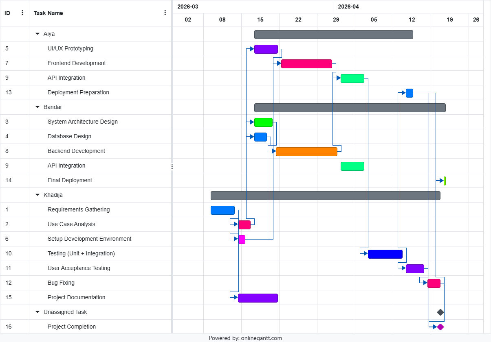

# Hotel Booking System

**Course:** CMPE314 – Software Engineering  
**Class Group:** Group 3

---

## Team Members

| Student ID | Name | GitHub |
|---|---|---|
| 22201315 | Khadija Bakari Isa | [GitHub Profile](https://github.com/KhadijaBakari00) |
| 22100923 | Bandar Mohamed | [GitHub Profile](https://github.com/) |
| 22204973 | Aiya Bitabarova | [GitHub Profile](https://github.com/Aiyabtw) |

---

## Project Description

Our project is a **Hotel Booking System** which allows users to search for available rooms, make reservations, and manage their bookings completely online. The system provides hotel administrators with tools to manage room availability, pricing, and guest information, it aims to smoothen the hotel reservation process for both guests and staff through a simple and intuitive web online interface.

---

## Lab 2 - Resource Allocation Gantt Chart

### Resource Allocation Decisions

We assigned **Bandar** to system architecture, database design, backend development, API integration, and final deployment, as he is responsible for the core technical infrastructure of the system. **Aiya** was assigned to UI/UX prototyping, frontend development, API integration, and deployment preparation, reflecting her focus on the user-facing side of the application. **Khadija** handled requirements gathering, use case analysis, environment setup, testing, user acceptance testing, bug fixing, and project documentation, covering the full project lifecycle from planning to quality assurance. Tasks like API Integration were shared between team members to reflect real collaboration between frontend and backend.

---

*CMPE314 – Software Engineering · Cyprus International University*
